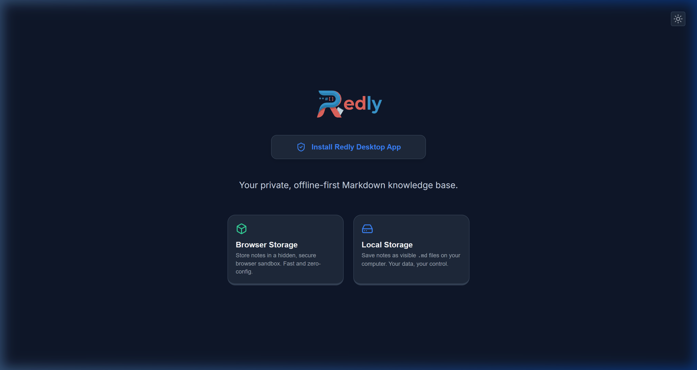
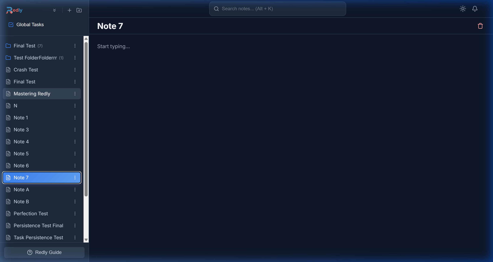
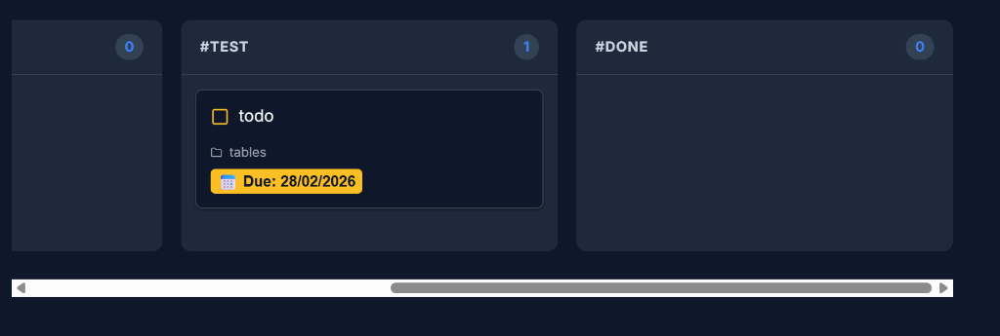

# Redly


### Your private, offline-first Markdown knowledge base.

Redly is a minimalist, powerful, and aesthetically pleasing note-taking application designed for people who value privacy, speed, and standard formats. It turns your local folders or browser storage into a sleek, searchable knowledge base.

## 🚀 Key Features

- **Local-First Architecture**: Your data never leaves your machine unless you explicitly export it.
- **Markdown Native**: Write using standard Markdown with a beautiful, rich-text live preview.
- **Integrated Global Search**: A sleek, header-embedded search bar that finds notes by filename or content instantly as you type.
- **Interactive Tasks**: Turn any note into a productivity hub with `@date` badges, interactive timelines, and a **Global Task & Kanban Dashboard**.
- **Keyboard-First Navigation**: Optimized for power users with comprehensive hotkeys for every major action.
- **PWA Support**: Install Redly as a desktop app for a native experience.
- **Dark Mode**: Beautifully curated themes for both night owls and day dreamers.
- **Backup & Restore**: Easily export and import your browser storage as JSON.

## 📦 Getting Started

### 1. Choose Your Storage

Redly offers two distinct storage "tiers" to balance privacy, convenience, and control:

- **Local Storage (Native File System)**: 
  - **Technical**: Uses the [File System Access API](https://developer.mozilla.org/en-US/docs/Web/API/File_System_Access_API) to map Redly directly to a folder on your computer.
  - **Experience**: Your notes are stored as plain `.md` files. This is the "ultimate control" mode—your files are yours, and you can edit them with any other editor simultaneously.
  - **Compatibility**: Required Chromium-based browsers (Chrome, Edge, Opera) on Desktop.

- **Browser Storage (Sandboxed)**:
  - **Technical**: Uses the [Origin Private File System (OPFS)](https://developer.mozilla.org/en-US/docs/Web/API/File_System_API/Origin_private_file_system).
  - **Experience**: Store notes in a secure, hidden browser sandbox. It is incredibly fast and zero-config. Perfect for a quick start or private browsing.
    -   **Compatibility**: High compatibility across all modern browsers (Chrome, Edge, Safari, Firefox) on both Desktop and Mobile.

### 2. Browser Compatibility Matrix

| Feature | Chrome / Edge | Safari | Firefox | Mobile (iOS/Android) |
|---|---|---|---|---|
| **PWA Installation** | ✅ (One-click) | ✅ (Manual) | ⚠️ (Limited) | ✅ (Add to Home) |
| **Browser Storage** | ✅ (OPFS) | ✅ (OPFS) | ✅ (OPFS) | ✅ (OPFS) |
| **Local Storage** | ✅ (Native API) | ❌ | ❌ | ❌ |
| **Dark Mode** | ✅ | ✅ | ✅ | ✅ |



## Quick Start

1.  **Open Redly**: Launch the app in your browser or from your home screen.
2.  **Choose Storage**: Select **Browser Storage** for a quick start or **Local Storage** to save files directly to your machine.
3.  **Start Writing**: Click the **New Note** button or press `Alt + N`.

### Formatting Made Simple


Redly supports full Markdown and provides a powerful **Slash Menu** to make formatting effortless:

*   **Slash Command**: Type `/` anywhere in a note to bring up a menu of formatting options (Headers, Lists, Todo items, Horizontal Rules, and more).
*   **Markdown Shortcuts**: Use standard syntax like `#` for headers, `**` for bold, and `---` for dividers.
*   **Smart Tasks**: Create interactive tasks with `- [ ]`. You can even add dates like `@today` or `@tomorrow` to see them in your Global Tasks view.



## Features

### 📅 Global Tasks & Kanban Dashboard

Never lose track of a deadline. The **Global Tasks** view aggregates every `- [ ]` task from all your notes, categorising them into an actionable dashboard. 

You can instantly switch between a classic list and an interactive **Kanban Board** by pressing `Alt + V`.
- **Custom Columns**: Add inline hashtags (e.g. `- [ ] Fix bugs #doing`) to sort tasks into specific stages.
- **Drag & Drop**: Drag a task from `#todo` to `#done`, and Redly will automatically rewrite the markdown in your raw notes.
- **Deep Linking**: Click anywhere on a task card to instantly auto-scroll to the exact note in your file tree.



## ⌨️ Power User Hotkeys

| Action | Shortcut |
|---|---|
| **Global Search** | `Alt + K` |
| New Note | `Alt + N` |
| New Folder | `Alt + F` |
| Go Home | `Alt + H` |
| Focus Sidebar | `Alt + S` |
| **Focus Editor** | `Alt + E` |
| **Enter Note** | `→` (Right Arrow) |
| Global Tasks | `Alt + T` |
| Toggle Kanban / List | `Alt + V` |
| Change Workspace | `Alt + W` |
| Help & Guide | `Alt + /` |
| Rename Selection | `F2` |
| Delete Selection | `Delete` |

## 🛡️ Privacy & Security

Redly is built on a "No Data Collection" philosophy. 
- **Offline First**: No cloud syncing, no logins, no tracking.
- **Standard Formats**: Your notes are yours. Even if you stop using Redly, your files are standard Markdown or JSON.
- **Transparent**: No hidden background processes or external telemetry.

For more details, see our full [Privacy Policy](PRIVACY.md).

## 📲 Installation (PWA)

Redly is a Progressive Web App (PWA), meaning it can be installed as a standalone app on your device for an offline-first, distraction-free experience.

- **One-Click Install**: On compatible browsers (Chrome/Edge), look for the **"Install Redly"** button prominently displayed on the Welcome and Home screens.
- **Manual Install (Safari/Firefox)**: 
  - On Safari (iOS): Tap the **Share** button and select **"Add to Home Screen"**.
  - On Other Browsers: Click the menu icon and look for **"Install App"** or **"App > Install this site"**.
- **Integrated Guide**: If a direct one-click install isn't possible, Redly provides a beautiful, step-by-step guide tailored to your specific browser.

## 🔨 Developer Setup

These commands are only required if you want to modify the source code or build the project from scratch.

```bash
# 1. Install dependencies
npm install

# 2. Run development server
npm run dev

# 3. Build for production (outputs to /dist)
npm run build
```

## 📄 License

Copyright (c) 2026 Jonathan Redsell. **All Rights Reserved.**
Unauthorized use, copying, or distribution is strictly prohibited.
